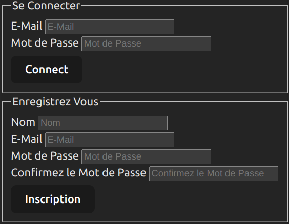
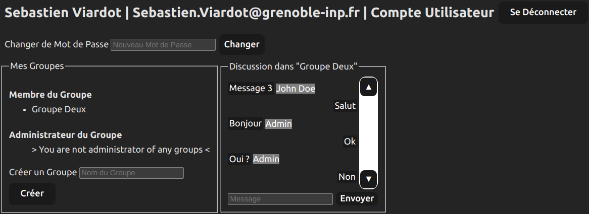
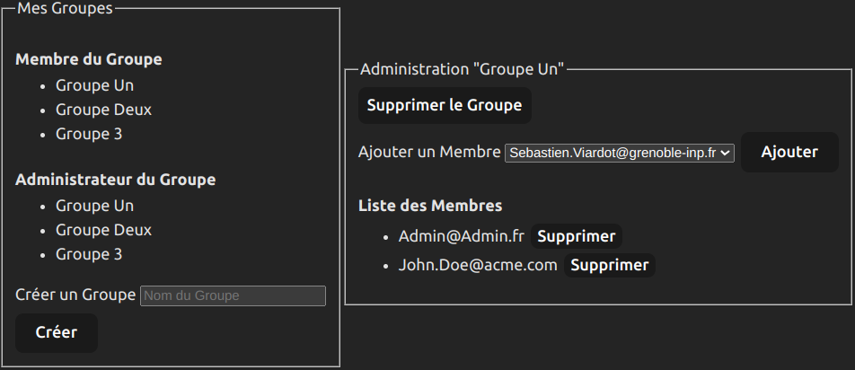
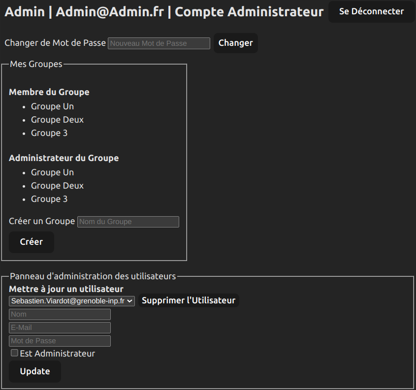

# Live-Messaging

[**Live-Messaging**](https://github.com/PyroWilDx/Live-Messaging/) is a real-time chat application that allows users to create groups and engage in conversations with multiple participants.

- Login View



- User View



- Group View



- Admin View



This project was made in a **Team of 1** as part of the **Web Development** course at [Grenoble INP &ndash; Ensimag](https://ensimag.grenoble-inp.fr/).

## Development Set-Up

<div align="center">

[](https://developer.mozilla.org/docs/Web/JavaScript/)
&nbsp;&nbsp;&nbsp;&nbsp;
[](https://code.visualstudio.com/)
&nbsp;&nbsp;&nbsp;&nbsp;
[](https://www.microsoft.com/windows/)

[React](https://react.dev/) \
[NodeJs](https://nodejs.org/)

</div>

### How To Use

- Install npm dependencies.

```
cd backend && npm install
```
```
cd frontend && npm install
```

- Start development server.

```
cd backend && npm run startdev
```
```
cd frontend && npm run dev
```

---

<div align="center">
  Copyright &#169; 2024 PyroWilDx. All Rights Reserved.
</div>
