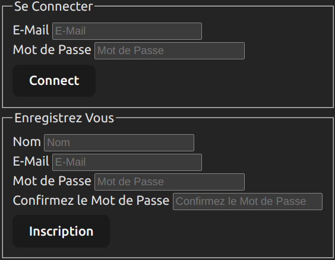
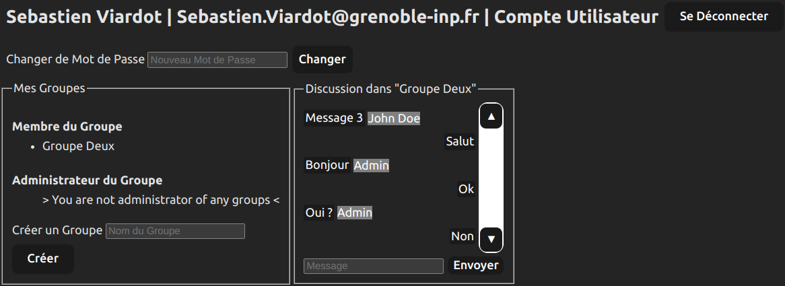
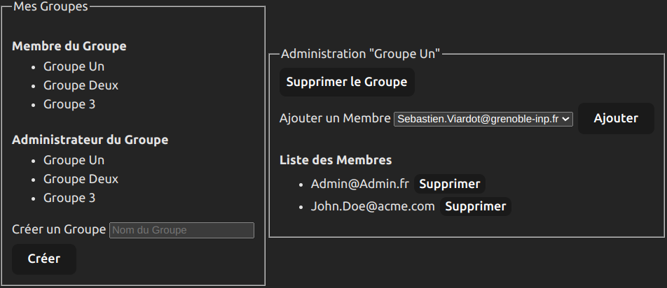
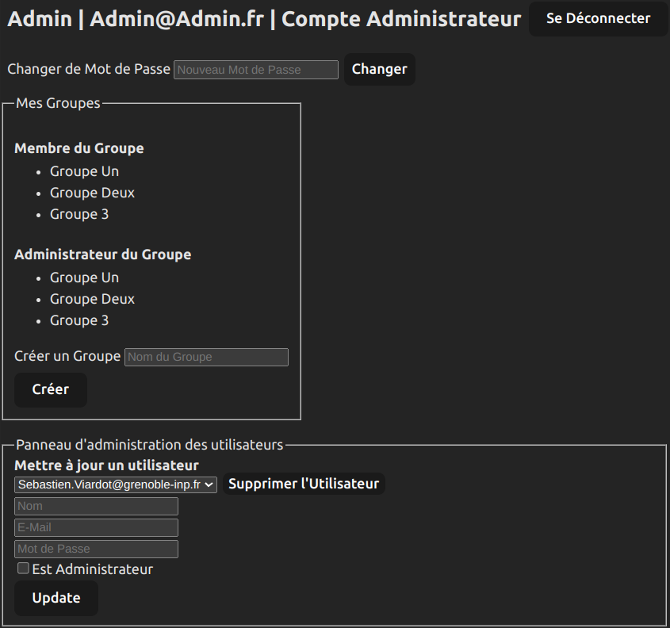

<div align="center">


A real-time chat application that allows users to create groups and engage in conversations with multiple participants.

</div>

## 🎓 School Project Information

|  |  |
|--|--|
| Team   | 1 |
| Course | Web Development |
| School | Grenoble INP - Ensimag |

## ✨ Overview

- Login View

<div align="center">



</div>

- User View

<div align="center">



</div>

- Group View

<div align="center">



</div>

- Admin View

<div align="center">



</div>

## 🛠️ How To Build

- Back-End.

```
cd backend
npm install
npm run startdev
```

- Front-End.

```
cd frontend
npm install
npm run dev
```

---

<div align="center">
  Copyright &#169; 2024 PyroWilDx. All Rights Reserved.
</div>
